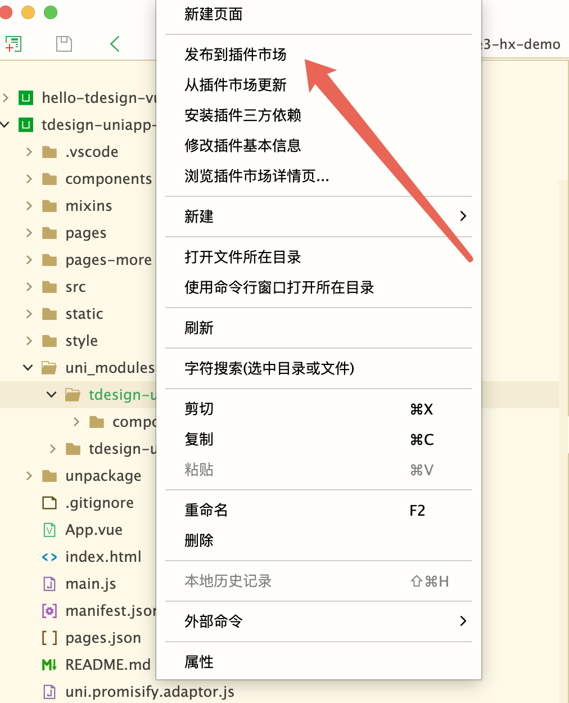

<p align="center">
  <a href="https://tdesign.tencent.com/" target="_blank">
    
  </a>
</p>

<p align="center">
  <a href="https://vuejs.org/"></a>
  <a href="https://vitejs.dev/"></a>
  <a href="https://tdesign.tencent.com/uniapp/getting-started"></a>
  <a href="LICENSE"></a>
</p>

# TDesign Uniapp Vue3 HBuilderX 示例

基于 Vue 3 + Vite + TDesign Uniapp 的 HBuilderX 示例项目，集成了 [tdesign-uniapp](https://ext.dcloud.net.cn/plugin?name=tdesign-uniapp) 和 [tdesign-uniapp-chat](https://ext.dcloud.net.cn/plugin?name=tdesign-uniapp-chat) 组件库插件。

## ✨ 特性

- 🎨 **TDesign 组件库** - 腾讯出品的企业级设计体系
- 💬 **Chat 组件库** - 内置 tdesign-uniapp-chat 聊天组件
- 📦 **开箱即用** - 完整的项目结构和配置，可直接在 HBuilderX 中运行
- ⚡ **Vite** - 极速的开发体验
- 🌐 **多平台支持** - H5 / 微信 / 支付宝 / 抖音 / QQ / 百度等

## 🔧 功能

本项目的主要作用：

1. 发布 [tdesign-uniapp](https://ext.dcloud.net.cn/plugin?name=tdesign-uniapp) / [tdesign-uniapp-chat](https://ext.dcloud.net.cn/plugin?name=tdesign-uniapp-chat) 插件
2. 作为上述插件的示例项目，一起上传到 DCloud 插件市场
3. 下载、验证插件是否正常
4. 用户查看开箱即用的配置

## 🚀 快速开始

### 初始化

```bash
# 1. 克隆本项目到 tdesign-miniprogram 同级目录
git clone https://github.com/TDesignOteam/tdesign-uniapp-starter-vue3-hx.git

# 2. 在 tdesign-miniprogram 下执行初始化
cd tdesign-miniprogram
npm run uniapp -- run init
```

### 安装依赖

```bash
# 进入项目目录
cd tdesign-uniapp-starter-vue3-hx

# 安装依赖
npm install
```

### 初始化插件

```bash
npm run init
```

该命令会依次执行以下步骤：

1. `npm run init:td` — 发布/同步 `tdesign-uniapp` 组件到 `uni_modules` 目录
2. `npm run init:chat` — 发布/同步 `tdesign-uniapp-chat` 组件到 `uni_modules` 目录
3. `npm run init:alias` — 全量替换项目中的 alias 路径为相对路径

### 开发模式（监听文件变化）

```bash
npm run watch
```

启动后会实时监听项目文件变化，自动将 alias 路径替换为相对路径。适用于开发阶段边写代码边自动替换。

## 📦 发布插件

发布插件到 DCloud 插件市场的步骤：

1. `git clone` 本项目到 `tdesign-miniprogram` 同级目录
2. 在 `tdesign-miniprogram` 下执行 `npm run build:uniapp && npm run build:uniapp:chat`
3. 本项目下执行 `npm run init`
4. 在 HBuilderX 中导入本项目
5. 在 `uni_modules/tdesign-uniapp` 目录上右键，点击发布到插件市场，填写表单进行发布



发布 `tdesign-uniapp-chat` 插件同理，只是目录位置换成了 `uni_modules/tdesign-uniapp-chat`。

### CHANGELOG 注意事项

1. 从 `npm changelog` 中复制
2. 不要用 🐞 🚧 这种图片，否则更新日志完全无法显示
3. 多个标题要换行，即第二个以及后面的 `###`

## 脚本说明

| 命令 | 说明 |
|---|---|
| `npm run init` | 完整初始化（同步组件 + 替换 alias） |
| `npm run init:td` | 同步 tdesign-uniapp 组件到 uni_modules |
| `npm run init:chat` | 同步 tdesign-uniapp-chat 组件到 uni_modules |
| `npm run init:alias` | 全量扫描并替换 alias 路径 |
| `npm run watch` | 监听文件变化，自动替换 alias 路径 |

## Alias 替换机制

项目中使用 alias 来简化组件引用路径，脚本会自动将 alias 替换为对应的相对路径。

### Alias 映射关系

| Alias | 对应目录 |
|---|---|
| `@tdesign/uniapp` | `uni_modules/tdesign-uniapp/components` |
| `@tdesign/uniapp-chat` | `uni_modules/tdesign-uniapp-chat/components` |

### 扫描范围

**目录：**

- `style/`
- `pages/`
- `pages-more/`
- `components/`
- `mixins/`
- `uni_modules/tdesign-uniapp-chat/components/`

**根目录文件：**

- `main.js`
- `App.vue`

**支持的文件类型：**

`.vue`、`.js`、`.ts`、`.d.ts`、`.less`、`.css`、`.scss`

### 全量替换 vs 监听替换

- **全量替换**（`npm run init:alias`）：一次性扫描所有目标文件并替换 alias，适用于初始化或批量处理。
- **监听替换**（`npm run watch`）：使用 chokidar 监听文件变化，当文件新增或修改时自动对**单个文件**进行 alias 替换。内置防重复启动（端口 12346）和防循环写入机制。

## 项目结构

```
├── components/         # 公共组件
├── mixins/             # 混入
├── pages/              # 主包页面
├── pages-more/         # 分包页面
├── style/              # 公共样式
├── uni_modules/        # uni-app 插件模块
│   ├── tdesign-uniapp/           # TDesign 基础组件库
│   └── tdesign-uniapp-chat/      # TDesign Chat 组件库
├── script/             # 构建/工具脚本
│   ├── publish-tdesign-uniapp/   # tdesign-uniapp 发布脚本
│   ├── publish-tdesign-uniapp-chat/ # tdesign-uniapp-chat 发布脚本
│   └── replace-alias/            # alias 替换脚本
│       ├── index.js              # 全量替换
│       └── watch.js              # 监听替换
├── App.vue
├── main.js
└── package.json
```

## 🔗 相关链接

- [TDesign Uniapp 组件库](https://tdesign.tencent.com/uniapp/getting-started)
- [TDesign Uniapp 插件市场](https://ext.dcloud.net.cn/plugin?name=tdesign-uniapp)
- [TDesign Uniapp Chat 插件市场](https://ext.dcloud.net.cn/plugin?name=tdesign-uniapp-chat)
- [uni-app 官方文档](https://uniapp.dcloud.net.cn/)
- [Vue 3 文档](https://cn.vuejs.org/)
- [Vite 文档](https://cn.vitejs.dev/)

## 📱 扫码预览


## 📄 License

[MIT](LICENSE)
